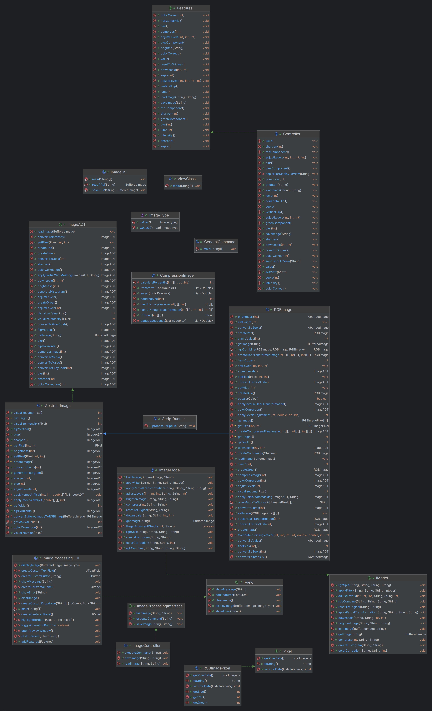

# Image Processing Project

Welcome to the **Image Processing Project**! This project provides a modular framework for manipulating images using a Model-View-Controller (MVC) architecture. The core functionality includes handling RGB images, transforming them through various operations, and managing user interactions via both command-line and script files.

## Table of Contents

- [Project Overview](#project-overview)
- [Project Structure](#project-structure)
- [Features](#features)
- [Getting Started](#getting-started)
    - [Prerequisites](#prerequisites)
    - [Installation](#installation)
- [Future Enhancements](#future-enhancements)

## Project Overview

This project provides extensive image processing capabilities focusing on RGB images. By leveraging the MVC architecture, it separates concerns, allowing easy extension or modification of image handling, UI components, and controller logic. Users can apply transformations, filter images, and automate operations via script-based interactions.

## Project Structure

- **ImageProcessingProject/**
    - **Controller/**
        - `ImageController.java`: Coordinates actions between the Model and View also handles load and save image operations.
        - `ImageProcessingInterface.java`: Interface with all public methods for the **ImageController.java** class.
        - `Controller` : This is  a GUI controller. Enabled by default on running jarFile.
        - `Features` : Represents the interface for the GUI Controller.
        - `ScriptRunner.java`: Executes predefined image-processing scripts and handles command-line input.
    - **Model/**
        - `ImageADT.java`: Core abstraction for image operations. Now supports additional features.
        - `ImageModel.java`: The class that communicates with the controller, supports transformations, filters, and histogram generation.
        - `Pixel.java`: Represents an individual pixel's behavior and properties.
        - `RGBImage.java`: Concrete implementation for handling RGB image data.
        - `RGBImagePixel.java`: Class for handling the RGB values of a single pixel.
        - `AbstractImage.java`: Abstract class providing base functionality for image types.
        - `IModel`: Interface that is implemented by the ImageModel (wrapper class) which communicates with the Controllers.
        - `ImageUtil`:  Utility class that supports the read and write logic for PPM format.
        - `CompressionImage`:  Compression class contains all the logic to compress the image.

  - **View/**
      - `ImageType.java`:  An enum used to distinguish between displaying a loaded image or a histogram image within the model.
      - `IView`: Represent the View interface with all public methods.
      - `ImageProcessingGUI.java`: Defines the Graphical User Interface code for our application.
  
  
  - `README.md`: The project documentation.
  - `Main`: The entry point of the application that handles input from the view, delegates commands to the controller, processes data through the model, and coordinates the flow of information back to the controller and the view.
  - `USEME.md`: Contains all the script commands to use the textBased interface.

## Features

- **Modular MVC Design**: Allows for easy extension of image processing operations and UI components.
- **Image Management**: The `ImageModel` class enables efficient management of image data, supporting loading, saving, and transforming images stored in a centralized map.
- **Transformations**: Supports flipping, rotating, brightness adjustment, and darkening.
- **Compression**: Creates a compressed version of an image with a specified compression percentage.
- **Histogram Generation**: Produces a 256x256 image histogram for red, green, and blue channels as line graphs.
- **Color Correction**: Adjusts image colors by aligning the peaks in its histogram.
- **Levels Adjustment**: Modifies image levels with specified black, mid, and white points.
- **Split View**: Allows partial application of transformations (blur, sharpen, sepia, grayscale, color correction, and levels adjustment) based on a vertical split line specified as a percentage of the image width.
- **RGB Split and Combine**: Supports splitting an image into red, green, and blue components and recombining them into a new image.
- **Scripted Batch Processing**: Supports running script files via command-line for automated, sequential transformations on images.
- **Interactive Command-line**: Allows users to enter commands interactively if no script file is provided.

## UML DIAGRAM

## Test Cases Refactor

The test cases in the **Model** and **Controller** packages under the **test/** directory have been refactored to adapt to the recent changes in the application. This includes adjustments to the implementation of image transformations, compression algorithms, and the introduction of new features such as split views and additional image processing options.

### Key Refactor Highlights:
- **Model Package**: Test cases now reflect the updated methods and their interactions, including changes to how image transformations like blur, sharpen, sepia, and grayscale are applied with optional split percentages.
- **Controller Package**: Refactored to handle the new `split` parameter functionality, with test cases validating its proper execution during image manipulation.
- **Compression & Histogram Tests**: Adjustments made to the compression-related tests to ensure correct output when applying different quality percentages, and histogram tests have been updated to reflect the changes in how histograms are generated for different image formats and transformations.
- **Downscaling & Partial Image Manipulations** : Enables downscaling an image based on valid width and height params, also allows uses to apply partial manipulations based on masked image supplied by the user.

These updates ensure that all aspects of the image processing pipeline are thoroughly tested against the latest functionality and that any potential regressions are identified during development.

## Getting Started

### Prerequisites
- Java Development Kit (JDK) 11.

### Installation
1. Clone the repository.
2. Navigate to the project directory and compile the Java files.
3. Run the application by specifying either a script file or entering commands interactively.
4. To learn more about the GUI and sample command inputs read the **`USEME.md`** file.

### Refactoring Updates

1. Introduced new methods in the existing interface to support features like compression, histogram generation, color correction, and level adjustment, implementing these in the `AbstractImage` and `RGBImage` classes.
2. Extracted the complex mathematical logic for compression into a dedicated class, integrating it into the model using the composition design pattern.
3. Developed overloaded methods for partial operations that reuse the existing logic for complete operations, ensuring code efficiency across all features.
4. Enhanced the text controller to handle new argument sets, enabling processing with the updated syntax.
5. Updated and regenerated the class diagram to reflect the latest changes.
6. Added two new beta features: image downscaling (GUI supported )and partial operations using a provided masked image (Text interface only).
7. Built a GUI-based controller to provide an interactive interface.
8. Created mock tests for the GUI controller and model, covering all newly added features.
9. Designed a new class, `Main`, to bridge the GUI controller, text controller, existing model, and GUI view.
10. Implemented a new view interface and its Java Swing-based implementation to support the updated user interface.

## Future Enhancements
- Support additional color models (e.g., CMYK, grayscale).
- Develop a graphical user interface for real-time image manipulation.

## Citation
- Images used for transformation are by **Raghav Kulkarni**.
